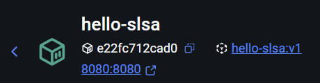
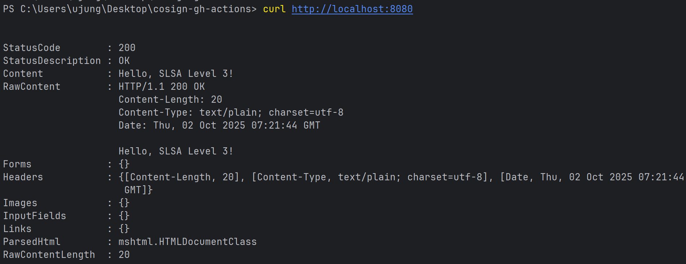
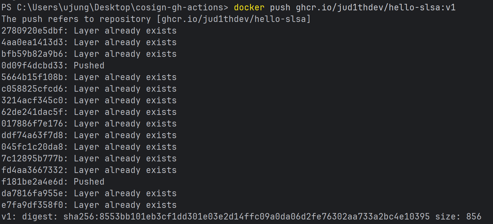
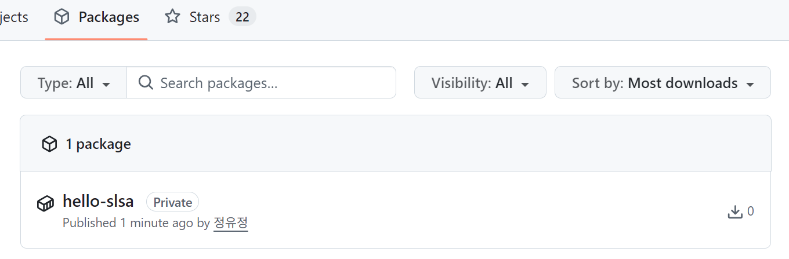
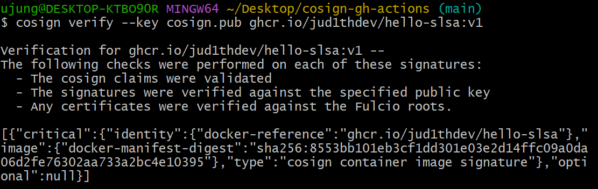

# cosign-gh-actions
slsa practice

## Week1

### 내용
- 간단한 Go 웹 서버 애플리케이션을 Docker 이미지로 빌드하고 컨테이너 실행
- 빌드한 이미지에 대해 cosign을 이용해 키 생성 후 서명(Sign) 및 공개키 기반 검증 수행

### 결과
1. Docker 컨테이너 실행

2. 동작 테스트

3. 이미지 서명/검증


4. 이미지 서명에 사용할 키 생성
[cosign.key](cosign.key) <br>
[cosign.pub](cosign.pub)
5. 이미지 서명 및 확인


```bash
Verification for [ghcr.io/jud1thdev/hello-slsa:v1](http://ghcr.io/jud1thdev/hello-slsa:v1) --
The following checks were performed on each of these signatures:

- The cosign claims were validated
- The signatures were verified against the specified public key
- Any certificates were verified against the Fulcio roots. 
# 여기까지는 검증 절차가 모두 성공했다는 뜻

[{
  "critical": {
    "identity": {
      "docker-reference": "ghcr.io/jud1thdev/hello-slsa" # 어떤 레포지토리 이미지에 대한 서명인지
    },
    "image": { 
      "docker-manifest-digest": "sha256:22c2568f8b54c2f7668ec3a031869ced6c050c4a361b15c72019310690554cff" 
      # 실제 이미지(manifest)를 SHA256으로 해시한 값
      # 이미지가 변조되면 이 해시가 달라져서 서명이 유효하지 않게 됨
    },
    "type": "cosign container image signature" # 이 서명이 cosign으로 생성된 컨테이너 이미지 서명임을 명시
  },
  "optional": null # 추가적인 메타데이터가 없는 경우 null로 표시
}]
```

- 지금 본 메시지는 ghcr.io에 올린 hello-slsa:v1 이미지가 cosign을 통해 서명되었고, 그 서명이 네가 가진 공개키로 올바르게 검증되었다는 뜻(누가 만든 건지 신뢰할 수 있고, 중간에 변조되지 않았다는 보장)
