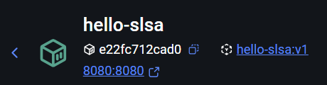
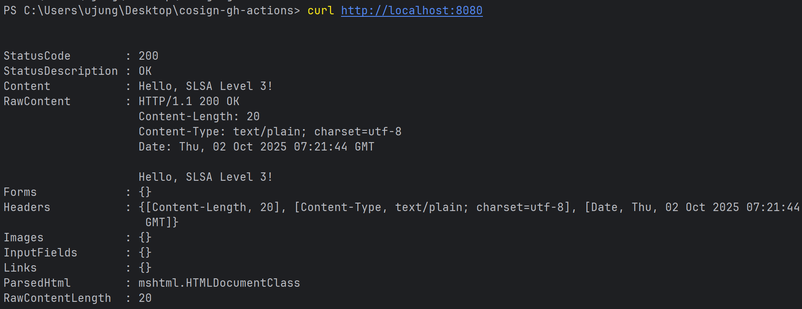
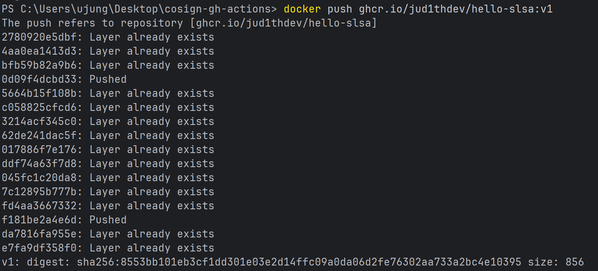
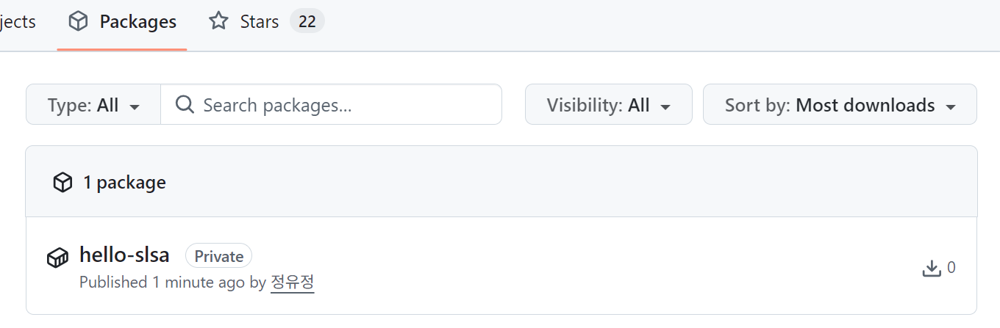
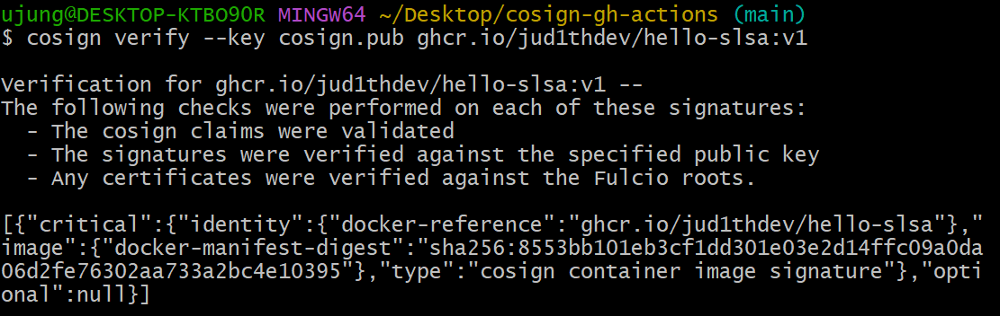
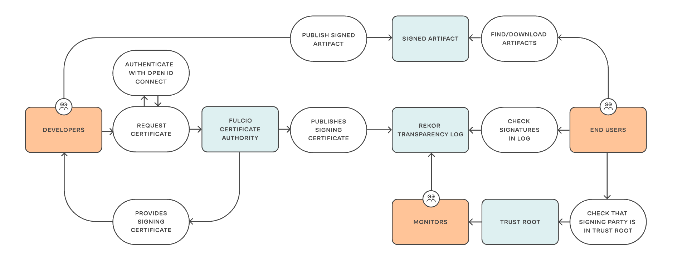

# Week 01

## 내용
- 간단한 Go 웹 서버 애플리케이션을 Docker 이미지로 빌드하고 컨테이너 실행
- 빌드한 이미지에 대해 cosign을 이용해 키 생성 후 서명(Sign) 및 공개키 기반 검증 수행
- [week01](../week01)

## 결과
1. Docker 컨테이너 실행 <br>
   
2. 동작 테스트 <br>
   
3. 이미지 서명/검증 <br>
   
   
4. 이미지 서명에 사용할 키 생성 <br>
   [cosign.key](../week01/cosign.key) <br>
   [cosign.pub](../week01/cosign.pub)
5. 이미지 서명 및 확인 <br>
   

```bash
Verification for [ghcr.io/jud1thdev/hello-slsa:v1](http://ghcr.io/jud1thdev/hello-slsa:v1) --
The following checks were performed on each of these signatures:

- The cosign claims were validated
- The signatures were verified against the specified public key
- Any certificates were verified against the Fulcio roots. 
# 여기까지는 검증 절차가 모두 성공했다는 뜻

[{
  "critical": {
    "identity": {
      "docker-reference": "ghcr.io/jud1thdev/hello-slsa" # 어떤 레포지토리 이미지에 대한 서명인지
    },
    "image": { 
      "docker-manifest-digest": "sha256:22c2568f8b54c2f7668ec3a031869ced6c050c4a361b15c72019310690554cff" 
      # 실제 이미지(manifest)를 SHA256으로 해시한 값
      # 이미지가 변조되면 이 해시가 달라져서 서명이 유효하지 않게 됨
    },
    "type": "cosign container image signature" # 이 서명이 cosign으로 생성된 컨테이너 이미지 서명임을 명시
  },
  "optional": null # 추가적인 메타데이터가 없는 경우 null로 표시
}]
```

- 지금 본 메시지는 ghcr.io에 올린 hello-slsa:v1 이미지가 cosign을 통해 서명되었고, 그 서명이 네가 가진 공개키로 올바르게 검증되었다는 뜻(누가 만든 건지 신뢰할 수 있고, 중간에 변조되지 않았다는 보장)

## TIL
### 이미지 서명/검증 흐름

1. 개발자나 CI/CD 파이프라인에서 이미지를 빌드하고 레지스트리에 Push
2. cosign sign 실행 시 → OIDC 로그인 요청 발생: cosign이 서명을 하기 위해 “누가 서명하는지” 신원 확인 목적 <br>
   % OpenID Connect: OAuth 2.0 위에 만들어진 인증 표준 프로토콜
3. 사용자가 GitHub 계정으로 로그인하면, Fulcio라는 인증 기관이 해당 계정에 기반한 짧은 수명 인증서를 발급
4. cosign이 그 인증서를 사용해서 Docker 이미지에 서명을 붙임
5. 생성된 서명과 관련 메타데이터가 Rekor 로그에 기록됨
6. 다른 사용자의 검증
    - 서명 자체가 올바른지 확인
    - 인증서가 Fulcio Root CA 기준으로 유효한지 확인
    - Rekor 로그에 해당 서명 기록이 존재하는지 확인