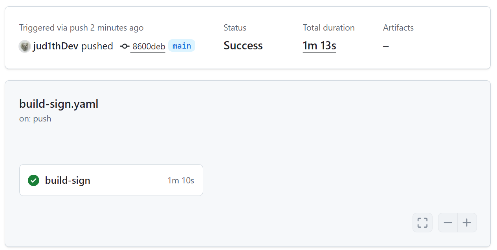
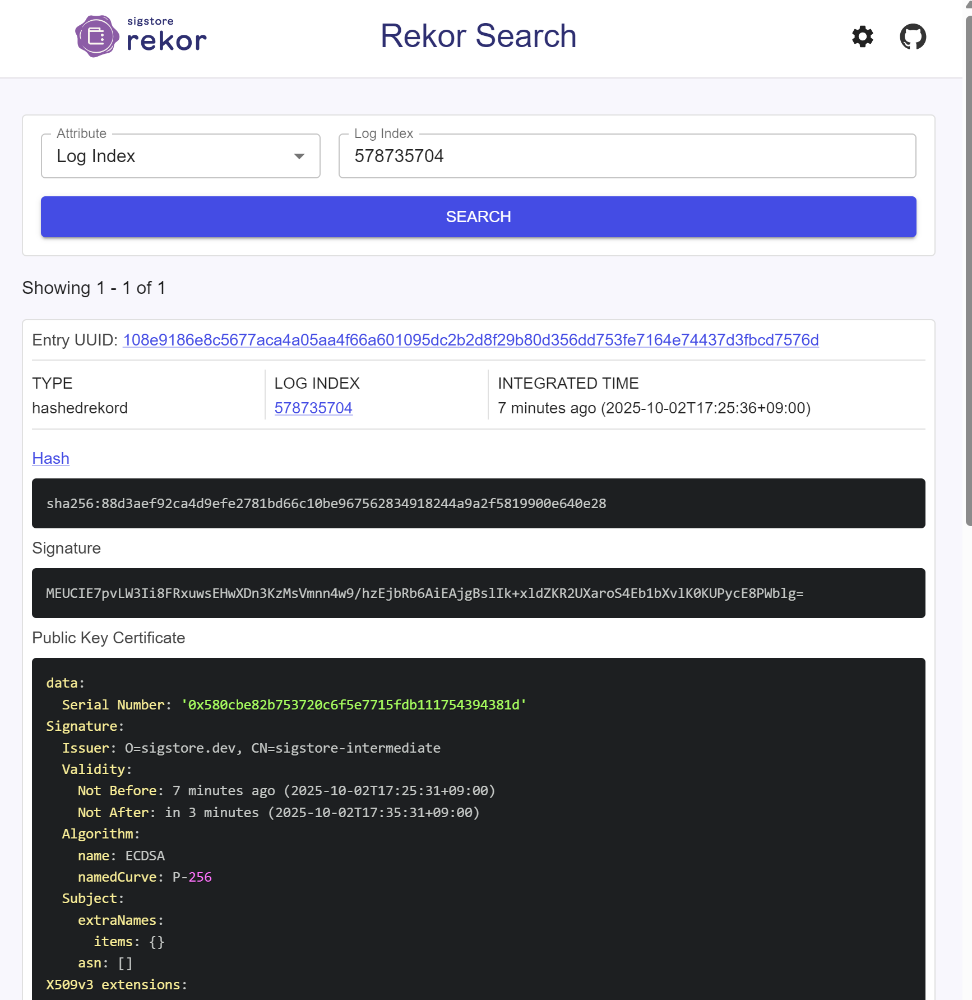

# Week 02

## 내용
- 1주차와 달리 별도 key 파일 없이 GitHub OIDC 기반(Keyless)으로 서명 수행
- 워크플로우 실행 시 Fulcio가 OIDC 토큰으로 단기 인증서 발급. 발급된 인증서로 cosign이 이미지 서명하고 Rekor 로그에 기록

## 결과
1. 워크플로우 생성 및 실행 <br>
[build-sign.yaml](../.github/workflows/build-sign.yaml) <br>

2. 이미지 서명 검증
```bash
# cosign verify 실행 결과
Verification for ghcr.io/jud1thdev/slsa-study-practice:sha-8600debd6cba98a61b35535036eca1fb3f6c1b93 --
The following checks were performed on each of these signatures:
  - The cosign claims were validated                  # cosign 서명 자체 검증
  - Existence of the claims in the transparency log was verified offline
  - The code-signing certificate was verified using trusted certificate authority certificates

# 서명된 이미지 정보
[{"critical":{"identity":{"docker-reference":"ghcr.io/jud1thdev/slsa-study-practice"},"image":{"docker-manifest-digest":"sha256:2500c77d4cf8ab7f2083ca37acefbf6cc8dc84cd184bd49d72f84320e21e6ee1"},"type":"cosign container image signature"},"optional":{
  "1.3.6.1.4.1.57264.1.1":"https://token.actions.githubusercontent.com",   # GitHub Actions OIDC
  "1.3.6.1.4.1.57264.1.2":"push",                                          # 트리거 이벤트
  "1.3.6.1.4.1.57264.1.3":"8600debd6cba98a61b35535036eca1fb3f6c1b93",      # 커밋 SHA
  "1.3.6.1.4.1.57264.1.4":"Build & Sign Image",                            # 워크플로우 이름
  "1.3.6.1.4.1.57264.1.5":"jud1thDev/SLSA-study-practice",                 # 저장소
  "1.3.6.1.4.1.57264.1.6":"refs/heads/main",                               # 브랜치
  "Bundle":{"SignedEntryTimestamp":"MEYCIQCZmPGnG2HijQrAh1I7X/U8UMnKLAz++94FiAzHGIYOtwIhAIBPs9gcFtLP0tc1boO7DSDLCn/UenF1d1d5TILFSZe5",
            "integratedTime":1759393536,                                   # Rekor 로그에 기록된 시간
            "logIndex":578735704,                                          # Rekor 로그 인덱스
            "logID":"c0d23d6ad406973f9559f3ba2d1ca01f84147d8ffc5b8445c224f98b9591801d"}}, 
  "Issuer":"https://token.actions.githubusercontent.com",                   # 인증서 발급자
  "Subject":"https://github.com/jud1thDev/SLSA-study-practice/.github/workflows/build-sign.yaml@refs/heads/main", # 인증서 주체(레포/워크플로우/브랜치)
  "githubWorkflowName":"Build & Sign Image",
  "githubWorkflowRepository":"jud1thDev/SLSA-study-practice",
  "githubWorkflowSha":"8600debd6cba98a61b35535036eca1fb3f6c1b93",
  "githubWorkflowTrigger":"push"}}]
```

3. 위의 로그에서 나타난 logIndex 활용해서 Rekor 로그 확인 <br>


```bash
Rekor Transparency Log 확인 결과
---------------------------------
Rekor Logo
Rekor Search
GitHub
logIndex
Attribute
578735704
Log Index
Showing 1 - 1 of 1

Entry UUID: 108e9186e8c5677aca4a05aa4f66a601095dc2b2d8f29b80d356dd753fe7164e74437d3fbcd7576d
Type
hashedrekord

Log Index
578735704

Integrated time
7 minutes ago (2025-10-02T17:25:36+09:00)

Hash
sha256:88d3aef92ca4d9efe2781bd66c10be967562834918244a9a2f5819900e640e28
Signature
MEUCIE7pvLW3Ii8FRxuwsEHwXDn3KzMsVmnn4w9/hzEjbRb6AiEAjgBslIk+xldZKR2UXaroS4Eb1bXvlK0KUPycE8PWblg=
Public Key Certificate
data:
  Serial Number: '0x580cbe82b753720c6f5e7715fdb111754394381d'
Signature:
  Issuer: O=sigstore.dev, CN=sigstore-intermediate
  Validity:
    Not Before: 7 minutes ago (2025-10-02T17:25:31+09:00)
    Not After: in 3 minutes (2025-10-02T17:35:31+09:00)
  Algorithm:
    name: ECDSA
    namedCurve: P-256
  Subject:
    extraNames:
      items: {}
    asn: []
X509v3 extensions:
  Key Usage (critical):
  - Digital Signature
  Extended Key Usage:
  - Code Signing
  Subject Key Identifier:
  - F5:75:8A:F4:42:DE:92:16:5C:68:AB:C2:33:18:6E:6C:26:56:5F:D8
  Authority Key Identifier:
    keyid: DF:D3:E9:CF:56:24:11:96:F9:A8:D8:E9:28:55:A2:C6:2E:18:64:3F
  Subject Alternative Name (critical):
    url:
    - https://github.com/jud1thDev/SLSA-study-practice/.github/workflows/build-sign.yaml@refs/heads/main
  OIDC Issuer: https://token.actions.githubusercontent.com
  GitHub Workflow Trigger: push
  GitHub Workflow SHA: 8600debd6cba98a61b35535036eca1fb3f6c1b93
  GitHub Workflow Name: Build & Sign Image
  GitHub Workflow Repository: jud1thDev/SLSA-study-practice
  GitHub Workflow Ref: refs/heads/main
  OIDC Issuer (v2): https://token.actions.githubusercontent.com
  Build Signer URI: https://github.com/jud1thDev/SLSA-study-practice/.github/workflows/build-sign.yaml@refs/heads/main
  Build Signer Digest: 8600debd6cba98a61b35535036eca1fb3f6c1b93
  Runner Environment: github-hosted
  Source Repository URI: https://github.com/jud1thDev/SLSA-study-practice
  Source Repository Digest: 8600debd6cba98a61b35535036eca1fb3f6c1b93
  Source Repository Ref: refs/heads/main
  Source Repository Identifier: '1064011982'
  Source Repository Owner URI: https://github.com/jud1thDev
  Source Repository Owner Identifier: '141399892'
  Build Config URI: https://github.com/jud1thDev/SLSA-study-practice/.github/workflows/build-sign.yaml@refs/heads/main
  Build Config Digest: 8600debd6cba98a61b35535036eca1fb3f6c1b93
  Build Trigger: push
  Run Invocation URI: https://github.com/jud1thDev/SLSA-study-practice/actions/runs/18187588001/attempts/1
  Source Repository Visibility At Signing: public
  1.3.6.1.4.1.11129.2.4.2: 04:7a:00:78:00:76:00:dd:3d:30:6a:c6:c7:11:32:63:19:1e:1c:99:67:37:02:a2:4a:5e:b8:de:3c:ad:ff:87:8a:72:80:2f:29:ee:8e:00:00:01:99:a4:06:c5:5d:00:00:04:03:00:47:30:45:02:21:00:cb:97:50:8f:fb:d3:cd:87:c3:0e:99:e4:a7:73:14:5e:d9:2d:a1:b7:df:81:10:0f:f6:e5:c0:90:ec:3b:d8:32:02:20:1b:ef:2e:e1:50:d6:82:3d:03:13:2c:ed:31:50:02:dd:36:7e:8d:e4:22:64:2f:2c:eb:f1:0c:3d:64:2c:6d:a4


Rekor Search
```
- logIndex/UUID 존재 유무
- Digest 확인: Rekor entry 안의 docker-manifest-digest 값이 push한 이미지와 동일한지
- 인증서(Subject) 확인: Subject가 GitHub repo (jud1thDev/SLSA-study-practice)랑 일치하는지
- 발급자 확인: Issuer가 Sigstore(Fulcio)에서 발급한 게 맞는지