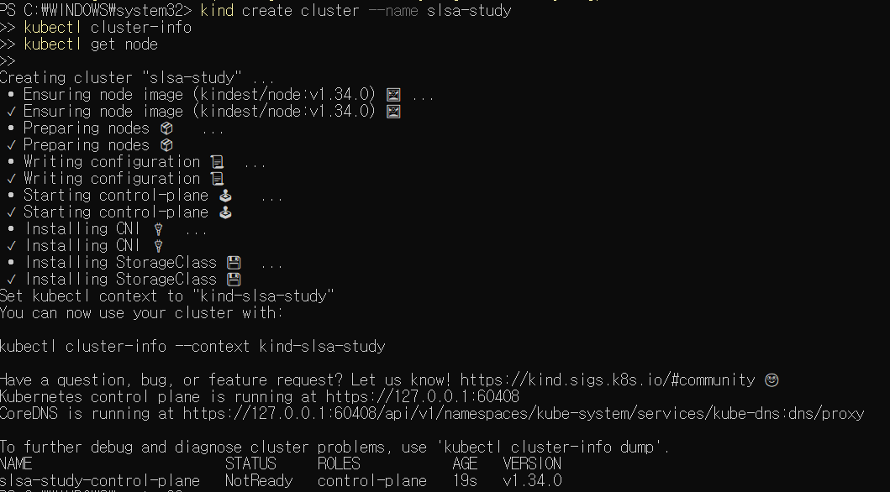
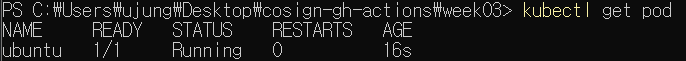
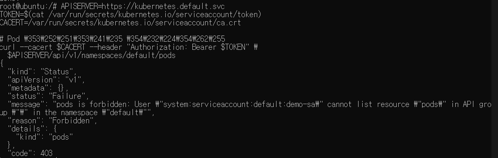
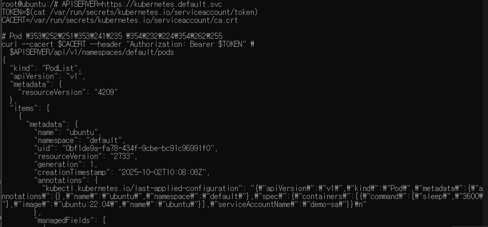
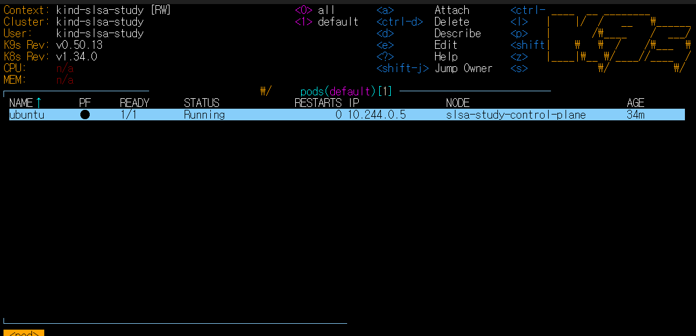

# Week 03

## 내용
- ServiceAccount → Role → RoleBinding → Pod 내부 curl 요청 → 권한 확인 과정 실습:
  - 로컬 kind 클러스터를 생성하고 kubectl 연결 확인  
  - demo-sa 계정을 사용하는 Pod을 생성하여 API Server에 접근 
  - RBAC 권한에 따라 pod 목록 조회가 성공하는지 확인

## 결과
### 1. 클러스터 생성
```bash
kind create cluster --name slsa-study
kubectl cluster-info
kubectl get node # get 명령어는 확인용
```


### 2. 테스트용 ubuntu Pod 배포
```bash
kubectl apply -f ubuntu.yaml
kubectl get pod
```

→ pod 생성 확인 후 exec 들어가서 <br>
% 나가려면 exit 명령어
```bash
kubectl exec -it ubuntu -- bash
```
curl 설치
```bash
apt update && apt install curl -y
```

### 3. pod 목록 조회
```bash
APISERVER=https://kubernetes.default.svc
TOKEN=$(cat /var/run/secrets/kubernetes.io/serviceaccount/token)
CACERT=/var/run/secrets/kubernetes.io/serviceaccount/ca.crt

# Pod 목록 요청
curl --cacert $CACERT --header "Authorization: Bearer $TOKEN" \
  $APISERVER/api/v1/namespaces/default/pods
```

→ `"message": "pods is forbidden: User \"system:serviceaccount:default:demo-sa\" cannot list resource \"pods\" in API group \"\" in the namespace \"default\""` <br>
demo-sa라는 ServiceAccount는 존재하지만, 아직 pods 리소스를 조회할 권한이 없음

### 4. Role/RoleBinding을 적용
[role.yaml](../week03/role.yaml) <br>
[rolebinding.yaml](../week03/rolebinding.yaml)
```bash
kubectl apply -f role.yaml
kubectl apply -f rolebinding.yaml
kubectl get role -n default 
kubectl get rolebinding -n default
```
이후 다시 pod 목록 조회하면.. <br>
 <br>
RBAC(Role + RoleBinding 적용)했으므로 PodList를 정상적으로 조회하는 것을 확인할 수 있다!

###  4-2. k9s
- k9s = 클러스터를 잘 다룰 수 있게 도와주는 GUI툴
- 그냥 k9s 라고 명령어 치면 진입


### 5. 클러스터 정리
```bash
apt update && apt install curl -y
```

## TIL
- Kubernetes에서 ServiceAccount는 Pod가 API 서버와 통신할 때 사용하는 ID 역할을 함 
- 기본 ServiceAccount는 권한이 없으므로, RBAC(Role-Based Access Control) 로 권한을 부여해야 함 
- Role은 특정 리소스에 대한 권한을 정의하고, RoleBinding은 해당 권한을 특정 사용자/ServiceAccount에 연결함(권한 제어)
