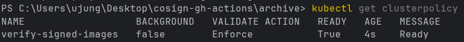

# Week 06

## 내용
- **이미지 서명 게이트(Signature Gate)** 이해 및 구축
- Kubernetes 환경에서 **이미지 서명(Attestation)을 검증하는 Admission Controller** 개념 이해
- **Cosign + Kyverno**를 이용해 서명된 이미지만 배포 가능한 환경 구현
- **ArgoCD**를 활용한 GitOps 기반 자동 배포 파이프라인 구성

### k8s 서명 검증 게이트 동작 흐름 요약
```
1. 개발자가 GitHub에 코드 푸시

2. GitHub Actions가 Docker 이미지 빌드 + Cosign으로 서명

3. 서명된 이미지가 Registry에 저장됨

4. ArgoCD가 Git 변경 감지 → Kubernetes에 자동 배포

5. Admission Controller(Kyverno)가 배포 요청을 검사

6. 서명이 유효하면 통과, 아니면 거부
```


## 결과

### 1. ArgoCD 설치 및 구성

ArgoCD 네임스페이스 생성 및 설치
```bash
kubectl create namespace argocd
kubectl apply -n argocd -f https://raw.githubusercontent.com/argoproj/argo-cd/stable/manifests/install.yaml
```

ArgoCD UI 접속을 위한 포트포워딩
```bash
kubectl port-forward svc/argocd-server -n argocd 8080:443
```

초기 비밀번호 확인
```bash
kubectl -n argocd get secret argocd-initial-admin-secret -o jsonpath="{.data.password}" | %{ [System.Text.Encoding]::UTF8.GetString([System.Convert]::FromBase64String($_)) }
```
→ username: admin


### 2. Kyverno 설치

```bash
kubectl create -f https://github.com/kyverno/kyverno/releases/download/v1.10.0/install.yaml
```

### 3. Docker Hub 액세스 토큰 설정

GitHub Actions에서 Docker Hub에 안전하게 로그인하기 위해 비밀번호 대신 액세스 토큰을 사용합니다.

- 액세스 토큰이란?
  - 비밀번호를 대체하는 더 안전한 인증 방법
  - 특정 용도로만 사용 가능하도록 권한 제한
  - 여러 개 생성 가능하며, 노출 시 해당 토큰만 삭제하면 됨
  - GitHub Actions 같은 자동화 환경에 적합

Docker Hub 액세스 토큰 생성 방법:
1. Docker Hub 로그인 (https://hub.docker.com)
2. Account Settings → Security 탭 이동
3. "New Access Token" 클릭
4. Token description 입력 (예: "GitHub Actions")
5. Access permissions: "Read, Write, Delete" 선택
6. "Generate" 클릭 후 생성된 토큰 복사 (⚠️ 이 화면을 닫으면 다시 볼 수 없음!)

GitHub Secrets 설정:
1. GitHub 저장소 → Settings → Secrets and variables → Actions
2. "New repository secret" 클릭하여 다음 시크릿 추가:
   - Name: `DOCKERHUB_USERNAME` / Value: Docker Hub 사용자 이름
   - Name: `DOCKERHUB_TOKEN` / Value: 생성한 액세스 토큰

### 4. GitOps 리포지토리 구성

GitHub 리포지토리에 다음 파일들을 생성:

1. GitHub Actions 워크플로우 파일 (.github/workflows/build-sign.yaml)

[build-sign-week06.yml](../.github/workflows/build-sign-week06.yml)


2. Kubernetes Deployment 파일 (k8s/deployment.yaml)

[deployment.yaml](../week06/k8s/deployment.yaml)

3. Kyverno 이미지 서명 검증 정책 (policy/verify-image-signature.yaml)

[verify-image-signature.yaml](../week06/policy/verify-image-signature.yaml)

4. ArgoCD Application 파일 (application.yaml)

[application.yaml](../week06/application.yaml)

### 5. 애플리케이션 배포

네임스페이스 생성
```bash
kubectl create ns slsa-demo
```

ArgoCD Application 적용
```bash
kubectl apply -f application.yaml
```

ArgoCD UI에서 배포 상태 확인
→ 서명된 이미지가 정상적으로 배포되는 것을 확인


### 6. 이미지 서명 검증 정책 적용

Kyverno ClusterPolicy 적용
```bash
kubectl apply -f verify-image-signature.yaml
```

정책이 정상적으로 생성되었는지 확인
```bash
kubectl get clusterpolicy
```



### 7. GitHub Actions를 통한 서명된 이미지 배포 테스트

GitHub Actions 워크플로우 수동 실행
→ 이미지 빌드 → 서명 → Push → Manifest 업데이트 → Git Push

ArgoCD가 변경사항 감지 및 자동 Sync
→ **서명된 이미지가 정상적으로 배포됨**

```bash
# ArgoCD 애플리케이션 상태 확인
kubectl get application slsa-demo -n argocd
```

```bash
# ArgoCD 컨트롤러 로그 확인
kubectl logs -n argocd -l app.kubernetes.io/name=argocd-application-controller --tail=20
```

```bash
# Pod 상태 확인
kubectl get pods -n slsa-demo
```


- ✅ Sync Status: `Synced`
- ✅ Health Status: `Healthy`

성공적으로 sync된 것을 확인할 수 있다.

### 8. 미서명 이미지 배포 차단 테스트

로컬에서 서명 없이 이미지 빌드 및 푸시
```bash
cd week06
docker build -t jud1th/slsa:unsigned .
docker push jud1th/slsa:unsigned
```

deployment.yaml의 image를 미서명 이미지로 수정
```yaml
image: jud1th/slsa:unsigned
```

(이미 이전 단계에서 진행함) Kyverno 정책 적용
```bash
kubectl apply -f week06/policy/verfiy-image-signature.yaml
```

미서명 이미지 배포 시도
```bash
kubectl set image deployment/slsa-demo app=jud1th/slsa:unsigned -n slsa-demo
```

Kyverno에 의한 배포 차단 확인


```
error: failed to patch image update to pod template: admission webhook "mutate.kyverno.svc-fail" denied the request:

resource Deployment/slsa-demo/slsa-demo was blocked due to the following policies

verify-signed-images:
  autogen-check-signature: "failed to verify image docker.io/jud1th/slsa:unsigned:
    .attestors[0].entries[0].keyless: failed to get roots from fulcio: initializing
    tuf: updating local metadata and targets: error updating to TUF remote mirror:
    invalid key"
```
Kyverno 정책이 미서명 이미지 배포를 성공적으로 차단하고, 서명된 이미지만 배포 가능한 보안 환경이 구축된 것을 확인할 수 있다.

## TIL

### 이미지 서명 게이트
- 우리가 만든 애플리케이션은 Docker 이미지라는 형태로 배포됨. 이 이미지를 누군가 몰래 바꾸면? → 악성 코드가 들어갈 수 있음.
- 이미지 서명 게이트: 서명이 없으면, Kubernetes가 배포를 거부하도록 막는 장치
- CI/CD 파이프라인에서 생성된 이미지가 변조되지 않았음을 보장

### Admission Controller의 역할
- 이미지 서명 게이트는 클러스터 입구에서 Admission Controller(게이트 키퍼)가 요청을 가로채서 검사하는 구조
- Kubernetes는 새로운 Pod 생성, Deployment 업데이트하기, helm install 같은 “리소스 등록” 요청을 계속 받음. 그런데 아무 요청이나 다 받으면 보안이 뚫리니까, k8s 안에 Admission Controller(게이터 키퍼)가 있음.
- Kubernetes의 **API 서버로 들어오는 모든 리소스 생성 요청을 가로채서** 검사/변경 가능
  - 정책 기반으로 요청을 검증(Validating)하거나 수정(Mutating)할 수 있음
  - OPA Gatekeeper, Kyverno 같은 Policy Engine이 Admission Controller를 확장하여 정책을 적용함

### Kyverno vs OPA Gatekeeper
- **Kyverno**: Kubernetes 네이티브 YAML 방식, 학습 곡선이 낮음
- **OPA Gatekeeper**: Rego 언어 사용, 더 복잡하지만 강력한 정책 표현 가능
- 둘 다 이미지 서명 검증을 지원하며, 목적에 따라 선택 가능

### GitOps
- 모든 배포 상태를 Git으로 관리하는 방식
- 모든 배포 이력이 Git에 기록되어 **추적 가능(Auditable)**
- 롤백이 간단함 (Git 커밋만 되돌리면 됨)

### ArgoCD
- 사람이 kubectl 안 쳐도 알아서 배포해주는 GitOps 도구
- Git 저장소를 Kubernetes의 Single Source of Truth로 삼아, 자동으로 동기화하고 배포 상태를 관리
- Kubernetes 환경의 배포 상태 = Git의 코드 상태
