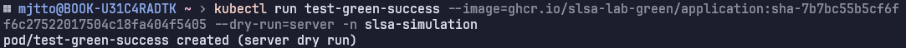

# CI Verfication Pipeline

## 목적

- kyverno 정책 설정을 통한 배포 전 CI 검증
- 악의적인 이미지 거부 및 권한 상승 방지

## kyverno 정책 설정

- disallow-latest-tag
  - latest 태그가 명시된 이미지 거부
  - 태그가 없는 이미지 거부
- require-run-as-noroot
  - `runAsNonRoot: true` 설정을 통한 루트 실행 금지
  - `privileged: false` 설정을 통한 특권 모드 거부
  - `allowPrivilegeEscalation: false` 설정을 통한 권한 상승 거부
- verify-image-signature
  - keyless 방식으로 issuer, subject(OIDC), rekor 기반 서명 검증 진행
  - `ghcr.io/slsa-lab-green` 에서 발행한 이미지에 대해서만 허용
  - 프라이빗 리포지토리에서 가져온 이미지를 검증하기 위해 kyverno 네임스페이스에 `imagePullSecret` 적용
- verify-sbom
  - SBOM(Sofware Bill of Materials) 검증
  - SBOM 데이터가 리포지토리와 일치하지 않으면 거부
  - 프라이빗 리포지토리에서 가져온 이미지를 검증하기 위해 kyverno 네임스페이스에 `imagePullSecret` 적용

---

## 정책 적용

- 우리 팀 이미지(`ghcr.io/slsa-lab-green`) 기반 pod 생성

    

  - 서명 검증 및 sbom 검증 통과
- 외부 이미지(nginx) 기반 pod, deployment 생성

    

    

  - 서명 및 sbom 검증 실패로 배포 거부됨
- 서명 + SBOM이 있는 다른 리포지토리의 이미지

    

  - 서명 및 SBOM의 정보가 현재 정책에 부합하지 않아 배포 거부됨
- 우리팀 이미지의 경우, argoCD에서 정상적으로 이미지를 Pull 받아와 실행되며 검증도 성공적임

---

- (이후 추가) require-security-context

    ```yaml
    Name:         require-security-context
    Namespace:
    Labels:       <none>
    Annotations:  <none>
    API Version:  kyverno.io/v1
    Kind:         ClusterPolicy
    Metadata:
      Creation Timestamp:  2025-10-23T00:37:06Z
      Generation:          1
      Resource Version:    2006394
      UID:                 0063b2c8-3da2-4074-8777-5babd1dc5be2
    Spec:
      Admission:       true
      Background:      true
      Emit Warning:    false
      Failure Policy:  Fail
      Rules:
        Exclude:
          Any:
            Resources:
              Namespaces:
                kube-system
                kube-public
                kube-node-lease
                kyverno
        Match:
          Any:
            Resources:
              Kinds:
                Pod
        Name:                      require-security-context
        Skip Background Requests:  true
        Validate:
          Allow Existing Violations:  true
          Message:                    Security context is required for all containers
          Pattern:
            Spec:
              Containers:
                Name:  *
                Security Context:
                  Allow Privilege Escalation:  false
                  Capabilities:
                    Drop:
                      ALL
                  Read Only Root Filesystem:  true
                  Run As Non Root:            true
      Validation Failure Action:              Enforce
    Status:
      Autogen:
        Rules:
          Exclude:
            Any:
              Resources:
                Namespaces:
                  kube-system
                  kube-public
                  kube-node-lease
                  kyverno
            Resources:
          Match:
            Any:
              Resources:
                Kinds:
                  DaemonSet
                  Deployment
                  Job
                  ReplicaSet
                  ReplicationController
                  StatefulSet
            Resources:
          Name:                      autogen-require-security-context
          Skip Background Requests:  true
          Validate:
            Allow Existing Violations:  true
            Message:                    Security context is required for all containers
            Pattern:
              Spec:
                Template:
                  Spec:
                    Containers:
                      Name:  *
                      Security Context:
                        Allow Privilege Escalation:  false
                        Capabilities:
                          Drop:
                            ALL
                        Read Only Root Filesystem:  true
                        Run As Non Root:            true
          Exclude:
            Any:
              Resources:
                Kinds:
                  CronJob
                Namespaces:
                  kube-system
                  kube-public
                  kube-node-lease
                  kyverno
            Resources:
          Match:
            Any:
              Resources:
                Kinds:
                  CronJob
            Resources:
          Name:                      autogen-cronjob-require-security-context
          Skip Background Requests:  true
          Validate:
            Allow Existing Violations:  true
            Message:                    Security context is required for all containers
            Pattern:
              Spec:
                Job Template:
                  Spec:
                    Template:
                      Spec:
                        Containers:
                          Name:  *
                          Security Context:
                            Allow Privilege Escalation:  false
                            Capabilities:
                              Drop:
                                ALL
                            Read Only Root Filesystem:  true
                            Run As Non Root:            true
      Conditions:
        Last Transition Time:  2025-10-23T00:37:06Z
        Message:               Ready
        Reason:                Succeeded
        Status:                True
        Type:                  Ready
      Rulecount:
        Generate:      0
        Mutate:        0
        Validate:      1
        Verifyimages:  0
      Validatingadmissionpolicy:
        Generated:  false
        Message:
    Events:
      Type     Reason           Age   From               Message
      ----     ------           ----  ----               -------
      Warning  PolicyViolation  52m   kyverno-scan       Deployment default/slsa-green-recovery-app: [autogen-require-security-context] fail; validation error: Security context is required for all containers. rule autogen-require-security-context failed at path /spec/template/spec/containers/0/securityContext/allowPrivilegeEscalation/
      Warning  PolicyViolation  51m   kyverno-scan       Deployment default/slsa-blue-app: [autogen-require-security-context] fail; validation error: Security context is required for all containers. rule autogen-require-security-context failed at path /spec/template/spec/containers/0/securityContext/
      Warning  PolicyViolation  49m   kyverno-scan       Pod argocd/argocd-notifications-controller-6598458df7-xxjt7: [require-security-context] fail; validation error: Security context is required for all containers. rule require-security-context failed at path /spec/containers/0/securityContext/runAsNonRoot/
      Warning  PolicyViolation  49m   kyverno-scan       Pod argocd/argocd-redis-7fdcfb697b-zc2qr: [require-security-context] fail; validation error: Security context is required for all containers. rule require-security-context failed at path /spec/containers/0/securityContext/runAsNonRoot/
      Warning  PolicyViolation  49m   kyverno-scan       Pod default/slsa-blue-app-7c4b8d996d-bs26q: [require-security-context] fail; validation error: Security context is required for all containers. rule require-security-context failed at path /spec/containers/0/securityContext/
      Warning  PolicyViolation  49m   kyverno-scan       Pod default/node-debugger-slsa-green-np-w-2780-jrjkx: [require-security-context] fail; validation error: Security context is required for all containers. rule require-security-context failed at path /spec/containers/0/securityContext/
      Warning  PolicyViolation  49m   kyverno-scan       ReplicaSet argocd/argocd-notifications-controller-5485dd498: [autogen-require-security-context] fail; validation error: Security context is required for all containers. rule autogen-require-security-context failed at path /spec/template/spec/containers/0/securityContext/runAsNonRoot/
      Warning  PolicyViolation  49m   kyverno-scan       ReplicaSet argocd/argocd-notifications-controller-6598458df7: [autogen-require-security-context] fail; validation error: Security context is required for all containers. rule autogen-require-security-context failed at path /spec/template/spec/containers/0/securityContext/runAsNonRoot/
      Warning  PolicyViolation  49m   kyverno-scan       ReplicaSet argocd/argocd-notifications-controller-77fd6f9885: [autogen-require-security-context] fail; validation error: Security context is required for all containers. rule autogen-require-security-context failed at path /spec/template/spec/containers/0/securityContext/runAsNonRoot/
      Warning  PolicyViolation  49m   kyverno-scan       ReplicaSet argocd/argocd-notifications-controller-86d7674db5: [autogen-require-security-context] fail; validation error: Security context is required for all containers. rule autogen-require-security-context failed at path /spec/template/spec/containers/0/securityContext/runAsNonRoot/
      Warning  PolicyViolation  49m   kyverno-scan       ReplicaSet argocd/argocd-notifications-controller-b95b5f65d: [autogen-require-security-context] fail; validation error: Security context is required for all containers. rule autogen-require-security-context failed at path /spec/template/spec/containers/0/securityContext/runAsNonRoot/
      Warning  PolicyViolation  49m   kyverno-scan       ReplicaSet argocd/argocd-redis-7fdcfb697b: [autogen-require-security-context] fail; validation error: Security context is required for all containers. rule autogen-require-security-context failed at path /spec/template/spec/containers/0/securityContext/runAsNonRoot/
      Warning  PolicyViolation  49m   kyverno-scan       ReplicaSet default/slsa-green-recovery-app-5cdfbf79d8: [autogen-require-security-context] fail; validation error: Security context is required for all containers. rule autogen-require-security-context failed at path /spec/template/spec/containers/0/securityContext/capabilities/
      Warning  PolicyViolation  49m   kyverno-scan       ReplicaSet default/slsa-blue-app-7c4b8d996d: [autogen-require-security-context] fail; validation error: Security context is required for all containers. rule autogen-require-security-context failed at path /spec/template/spec/containers/0/securityContext/
      Warning  PolicyViolation  49m   kyverno-scan       ReplicaSet default/slsa-green-recovery-app-77dff66697: [autogen-require-security-context] fail; validation error: Security context is required for all containers. rule autogen-require-security-context failed at path /spec/template/spec/containers/0/securityContext/allowPrivilegeEscalation/
      Warning  PolicyViolation  49m   kyverno-scan       ReplicaSet default/slsa-green-recovery-app-7b577d4455: [autogen-require-security-context] fail; validation error: Security context is required for all containers. rule autogen-require-security-context failed at path /spec/template/spec/containers/0/securityContext/capabilities/
      Warning  PolicyViolation  48m   kyverno-admission  Pod default/slsa-green-recovery-app-77dff66697-bztpq: [require-security-context] fail (blocked); validation error: Security context is required for all containers. rule require-security-context failed at path /spec/containers/0/securityContext/allowPrivilegeEscalation/
      Warning  PolicyViolation  32m   kyverno-admission  Pod default/slsa-green-recovery-app-77dff66697-rg6pc: [require-security-context] fail (blocked); validation error: Security context is required for all containers. rule require-security-context failed at path /spec/containers/0/securityContext/allowPrivilegeEscalation/
      Warning  PolicyViolation  15m   kyverno-admission  Pod default/slsa-green-recovery-app-77dff66697-9f95f: [require-security-context] fail (blocked); validation error: Security context is required for all containers. rule require-security-context failed at path /spec/containers/0/securityContext/allowPrivilegeEscalation/
      Warning  PolicyViolation  7m8s  kyverno-scan       Deployment argocd/argocd-redis: [autogen-require-security-context] fail; validation error: Security context is required for all containers. rule autogen-require-security-context failed at path /spec/template/spec/containers/0/securityContext/runAsNonRoot/
      Warning  PolicyViolation  7m8s  kyverno-scan       Deployment argocd/argocd-notifications-controller: [autogen-require-security-context] fail; validation error: Security context is required for all containers. rule autogen-require-security-context failed at path /spec/template/spec/containers/0/securityContext/runAsNonRoot/
    ```
