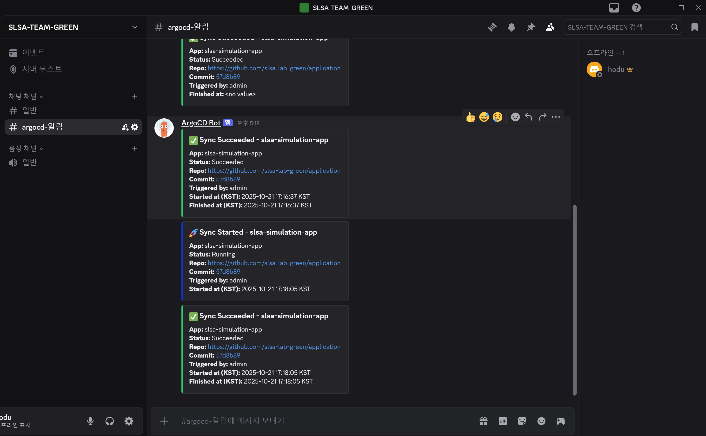

# ArgoCD Slack/Discord Sync 알림 연동

1. Discord Webhook 설정
    1. [참고](https://louky0714.tistory.com/163)
    
2. ArgoCD Notification 트리거 & 템플릿 배포
    
    ```bash
    kubectl apply -n argocd -f https://raw.githubusercontent.com/argoproj/argo-cd/stable/notifications_catalog/install.yaml
    ```
    
3. ArgoCD Notification 설정
    1. argo-notifications secret 설정
        1. argo-notifications-secret.yaml 작성 & apply
            
            <details>
            <summary>argo-notifications-secret.yaml</summary>
            <div markdown="1">

              ```yaml
              apiVersion: v1
              kind: Secret
              metadata:
                name: argocd-notifications-secret
                namespace: argocd
              type: Opaque
              stringData:
                notifiers.yaml: |
                  webhook:
                  - name: discord-webhook
                    url: https://discord.com/api/webhooks/1430094316801359935/EEgDawdag34OFkqAkHuxj5BFB3IJmH9-kg1MaQ_v5oxtl_Py6jVmvfYGMA9yuLL47Hau
                    headers:
                    - name: Content-Type
                      value: application/json
              ```

            </div>
            </details>
        
    2. argocd-notifications configmap 설정
        1. argocd-notifications-cm.yaml 작성 & apply
        2. service는 `service.webhook.<webhook-name>` 으로 
        secret의 webhook-name과 같게 설정
        3. template은 `template.<trigger-send>` 으로 trigger의 send에서 설정한 템플릿 명과 같게 설정

            <details>
            <summary>argocd-notifications-cm.yaml</summary>
            <div markdown="1">

              ```yaml
              apiVersion: v1
              kind: ConfigMap
              metadata:
                name: argocd-notifications-cm
                namespace: argocd
              data:
                service.webhook.discord-webhook: |
                  url: https://discord.com/api/webhooks/1430094316801359935/EEgDawdag34OFkqAkHuxj5BFB3IJmH9-kg1MaQ_v5oxtl_Py6jVmvfYGMA9yuLL47Hau
                  headers:
                  - name: Content-Type
                    value: application/json
              
                # 1. Sync 시작 알림
                trigger.sync-started: |
                  - when: app.status.operationState.phase == 'Running'
                    send: [ discord-sync-started ]
              
                # 2. Sync 성공 알림
                trigger.sync-succeeded: |
                  - when: app.status.operationState.phase == 'Succeeded'
                    send: [ discord-sync-succeeded ]
              
                # 3. Sync 실패 알림
                trigger.sync-failed: |
                  - when: app.status.operationState.phase in ['Error', 'Failed']
                    send: [ discord-sync-failed ]
              
                # 템플릿 1: Sync 시작
                template.discord-sync-started: |
                  webhook:
                    discord-webhook:
                      method: POST
                      body: |
                        {
                          "embeds": [
                            {
                              "title": "🚀 Sync Started - {{ .app.metadata.name }}",
                              "description": "**App:** {{ .app.metadata.name }}\n**Status:** Running\n**Repo:** {{ .app.spec.source.repoURL }}\n**Commit:** [{{ .app.status.sync.revision | trunc 7 }}]( {{ .app.spec.source.repoURL }}/commit/{{ .app.status.sync.revision }} )\n**Triggered by:** {{ if .app.status.operationState.operation.initiatedBy.username }}{{ .app.status.operationState.operation.initiatedBy.username }}{{ else }}(Automated){{ end }}\n**Started at (KST):** {{ if .app.status.operationState.operation.startedAt }}{{ toDate "2006-01-02T15:04:05Z07:00" .app.status.operationState.operation.startedAt | dateModify "+9h" | date "2006-01-02 15:04:05" }} KST{{ else if .app.status.operationState.startedAt }}{{ toDate "2006-01-02T15:04:05Z07:00" .app.status.operationState.startedAt | dateModify "+9h" | date "2006-01-02 15:04:05" }} KST{{ else }}(N/A){{ end }}",
                              "color": 1127128
                            }
                          ]
                        }
              
                # 템플릿 2: Sync 성공
                template.discord-sync-succeeded: |
                  webhook:
                    discord-webhook:
                      method: POST
                      body: |
                        {
                          "embeds": [
                            {
                              "title": "✅ Sync Succeeded - {{ .app.metadata.name }}",
                              "description": "**App:** {{ .app.metadata.name }}\n**Status:** Succeeded\n**Repo:** {{ .app.spec.source.repoURL }}\n**Commit:** [{{ .app.status.sync.revision | trunc 7 }}]( {{ .app.spec.source.repoURL }}/commit/{{ .app.status.sync.revision }} )\n**Triggered by:** {{ if .app.status.operationState.operation.initiatedBy.username }}{{ .app.status.operationState.operation.initiatedBy.username }}{{ else }}(Automated){{ end }}\n**Started at (KST):** {{ if .app.status.operationState.operation.startedAt }}{{ toDate "2006-01-02T15:04:05Z07:00" .app.status.operationState.operation.startedAt | dateModify "+9h" | date "2006-01-02 15:04:05" }} KST{{ else if .app.status.operationState.startedAt }}{{ toDate "2006-01-02T15:04:05Z07:00" .app.status.operationState.startedAt | dateModify "+9h" | date "2006-01-02 15:04:05" }} KST{{ else }}(N/A){{ end }}\n**Finished at (KST):** {{ if .app.status.operationState.operation.finishedAt }}{{ toDate "2006-01-02T15:04:05Z07:00" .app.status.operationState.operation.finishedAt | dateModify "+9h" | date "2006-01-02 15:04:05" }} KST{{ else if .app.status.operationState.finishedAt }}{{ toDate "2006-01-02T15:04:05Z07:00" .app.status.operationState.finishedAt | dateModify "+9h" | date "2006-01-02 15:04:05" }} KST{{ else }}(N/A){{ end }}",
                              "color": 3066993
                            }
                          ]
                        }
              
                # 템플릿 3: Sync 실패
                template.discord-sync-failed: |
                  webhook:
                    discord-webhook:
                      method: POST
                      body: |
                        {
                          "embeds": [
                            {
                              "title": "❌ Sync Failed - {{ .app.metadata.name }}",
                              "description": "**App:** {{ .app.metadata.name }}\n**Status:** {{ .app.status.operationState.phase }}\n**Repo:** {{ .app.spec.source.repoURL }}\n**Commit:** [{{ .app.status.sync.revision | trunc 7 }}]( {{ .app.spec.source.repoURL }}/commit/{{ .app.status.sync.revision }} )\n**Triggered by:** {{ if .app.status.operationState.operation.initiatedBy.username }}{{ .app.status.operationState.operation.initiatedBy.username }}{{ else }}(Automated){{ end }}\n**Started at (KST):** {{ if .app.status.operationState.operation.startedAt }}{{ toDate "2006-01-02T15:04:05Z07:00" .app.status.operationState.operation.startedAt | dateModify "+9h" | date "2006-01-02 15:04:05" }} KST{{ else if .app.status.operationState.startedAt }}{{ toDate "2006-01-02T15:04:05Z07:00" .app.status.operationState.startedAt | dateModify "+9h" | date "2006-01-02 15:04:05" }} KST{{ else }}(N/A){{ end }}\n**Finished at (KST):** {{ if .app.status.operationState.operation.finishedAt }}{{ toDate "2006-01-02T15:04:05Z07:00" .app.status.operationState.operation.finishedAt | dateModify "+9h" | date "2006-01-02 15:04:05" }} KST{{ else if .app.status.operationState.finishedAt }}{{ toDate "2006-01-02T15:04:05Z07:00" .app.status.operationState.finishedAt | dateModify "+9h" | date "2006-01-02 15:04:05" }} KST{{ else }}(N/A){{ end }}",
                              "color": 15158332
                            }
                          ]
                        }
              ```
            </div>
            </details>
        
    3. ConfigMap & Secret 인식 확인
        - 입력
            
            ```bash
            kubectl describe deployment argocd-notifications-controller -n argocd | grep -E "CONFIGMAP|SECRET"
            ```
            
        - 출력
            
            ```bash
            ARGOCD_NOTIFICATIONS_CONFIGMAP_NAME=argocd-notifications-cm
            ARGOCD_NOTIFICATIONS_SECRET_NAME=argocd-notifications-secret
            ```
            
          <details>
          <summary>출력이 되지 않을 시 Deployment 수동 Patch</summary>
          <div markdown="1">

            ```bash
            kubectl patch deployment argocd-notifications-controller -n argocd \
              --type='json' \
              -p='[
                {"op": "add", "path": "/spec/template/spec/containers/0/env", "value": [
                  {"name": "ARGOCD_NOTIFICATIONS_CONFIGMAP_NAME", "value": "argocd-notifications-cm"},
                  {"name": "ARGOCD_NOTIFICATIONS_SECRET_NAME", "value": "argocd-notifications-secret"}
                ]}
              ]'
            ```
          </div>
          </details>
            
    
4. ArgoCD Application에 Notification Subscriptions 적용
    
    
    

1. Result
    
    