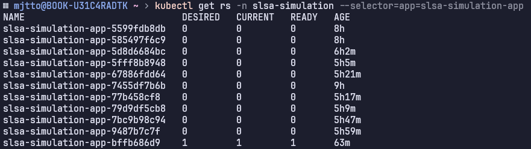

# Blue 팀 공격 대응 보고서

## 목적

이 문서는 Blue 팀의 ArgoCD 권한 탈취 공격에 대한 Green 팀의 대응 과정을 기록한 사고 대응 보고서입니다.

## 상황


### 발생 시점

- **발생**: 22일 21시~22시
- **발견**: 22일 23시

### 탈취당한 것들

- **애플리케이션**: slsa-simulation-app
- **ArgoCD 권한**: slsa-blue-cluster에서 점유
- **클러스터 권한**: get 명령어만 가능하게 강등됨
- **웹사이트**: http://223.130.142.127:30080/ 에서 파란색(Blue 팀 점유) 표시

## 해결 과정

### 시도했으나 실패한 방안들

- ArgoCD 애플리케이션 수정 (Forbidden)
- 포트 포워딩 (Forbidden)
- 새로운 배포 생성 (Forbidden)

### **우회 전략 수립 및 실행**

- 권한 없음으로 기존 앱을 복구하는 것은 불가하니까, 새롭게 생성하자!
- slsa-green-recovery-app이라는 새로운 애플리케이션 생성 및 배포
    - https://github.com/slsa-lab-green/application/actions/runs/18722785051
- **결과**: ArgoCD 권한 탈취 문제는 우회 전략으로 해결됨

<br>
<br>

## 클러스터 권한 복구 시도

### Blue 팀 클러스터 접속

```yaml
kubectl config use-context nks_kr_slsa-blue-cluster_<blue-team-uuid>
```

### 정책 확인

```yaml
kubectl get clusterrolebindings -o wide
```

- 처음엔 정책을 하나씩 수정해서 그린팀 UUID에 권한을 주려 했으나.. 번거로워서 그냥 전부 삭제했음.
- **결과**: 여전히 get 명령어만 가능한 상태로 클러스터 권한 복구 실패

<br>
<br>

## NKS API를 통한 클러스터 권한 복구

### change_clusterRole.sh 스크립트

<details>
<summary>change_clusterRole.sh</summary>

```bash
#!/bin/bash
# Usage: ./change_clusterRole.sh

# ======================
# 1. 사용자 정보
# ======================
ACCESS_KEY=<access key>
SECRET_KEY=<secret key>
CLUSTER_UUID="<cluster uuid>"
entryUuid="<iam uuid>"

# ======================
# 2. 요청 구성
# ======================
METHOD="PUT"
URI="/vnks/v2/clusters/${CLUSTER_UUID}/access-entries/${entryUuid}"
HOST="https://nks.apigw.ntruss.com"
URL="${HOST}${URI}"
TIMESTAMP=$(echo $(($(date +%s%N)/1000000)))

BODY=$(cat <<EOF
{
  "policies": [
    {
      "type": "NKSClusterAdminPolicy",
      "scope": "cluster"
    }
  ]
}
EOF
)

# ======================
# 3. 서명 생성
# ======================
nl=$'\n'
SIG="$METHOD $URI${nl}$TIMESTAMP${nl}$ACCESS_KEY"
SIGNATURE=$(echo -n -e "$SIG" | openssl dgst -sha256 -hmac $SECRET_KEY -binary | openssl enc -base64)

# ======================
# 4. 요청 디버그 출력
# ======================
echo "----------------------------------------"
echo "[DEBUG] TIMESTAMP : $TIMESTAMP"
echo "[DEBUG] SIGNATURE : $SIGNATURE"
echo "[DEBUG] URL       : $URL"
echo "----------------------------------------"

# ======================
# 5. API 호출
# ======================
curl -X ${METHOD} "${URL}" \
  -H "x-ncp-apigw-timestamp: ${TIMESTAMP}" \
  -H "x-ncp-iam-access-key: ${ACCESS_KEY}" \
  -H "x-ncp-apigw-signature-v2: ${SIGNATURE}" \
  -H "Accept: application/json" \
  -H "Content-Type: application/json; charset=UTF-8" \
  -d "${BODY}"

# ======================
# 6. 에러 핸들링
# ======================
if [ $? -ne 0 ]; then
  echo "[ERROR] 요청 실패! openssl 또는 curl 오류 확인 필요"
fi
```

</details>

### 참고자료
- [NKS API 공식 문서 (iam 엑세스 수정)](https://api.ncloud-docs.com/docs/nks-updateaccessentry)
- [NKS API 공식 문서 (iam 엑세스 목록 조회) - iam UUID 확인용](https://api.ncloud-docs.com/docs/nks-getaccessentrylist)
- [NKS IAM 엑세스 권한 목록](https://guide.ncloud-docs.com/docs/k8s-iam-auth-management-access-entry)

<details>
<summary>NKS IAM 엑세스 권한 목록</summary>

.png)

</details> 

### 문제 분석 및 해결 과정

1. **문제 상황**
   - 모든 팀의 User는 동일한 access token과 secret token을 사용
   - 그럼에도 Blue 팀이 클러스터 접근이 가능한 이유는?

2. **가설 수립**:
   - 가설 1) 직접 우리 클러스터에 접근해 차단 정책을 설정했다
   - 가설 2) NCP master 계정을 얻어 우리 계정 권한을 수정했다

3. **가설 2 검증**
   - API 문서 탐색 결과: IAM과 Cluster 권한 수정 API 발견
   - 테스트 결과: 현재 ~/.ncloud/configure로도 수정 가능
   - 조회 결과: Policy가 NKSViewPolicy로 설정되어 있음을 확인

4. **발견**
   - ClusterRole을 클러스터 내부에서 직접 구성하는 것이 아니라 NKS API를 통해 구성 가능

### 결과
- NKS API를 통해 권한을 NKSClusterAdminPolicy로 변경 성공
- 클러스터 권한 완전 복구 완료

### 교훈(방어 개선점)
- ClusterRole을 클러스터 내부에서 직접 Binding하는 것보다 중앙 통제를 위해 IAM에 의존하는 것이 보안상 더 안전
